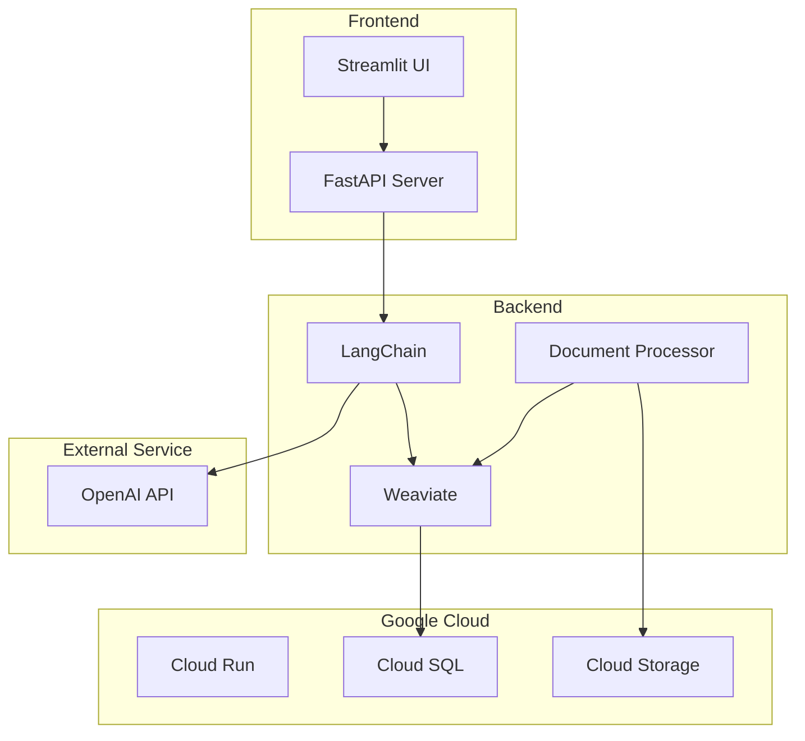
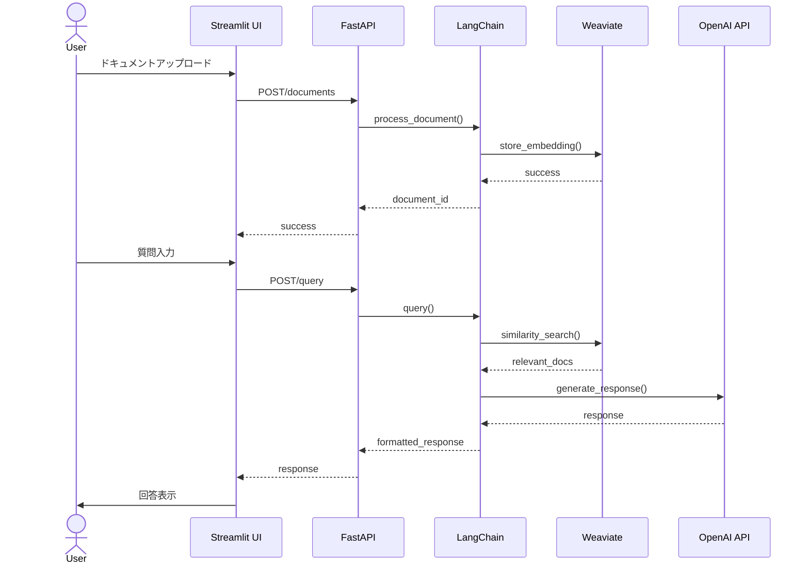

## 概要
RAGシステム
詳しくはあとで書く

## リファレンス
- 後でかく
  
## セットアップ

### 開発環境を準備する
1. [Python](https://www.python.org/)（v3.11以上のLTS）をインストール
2. [Node.js](https://nodejs.org/)（v22以上）をインストール
3. [Docker Desktop](https://docs.docker.com/get-docker/) をインストール
4. `python --version && node -v && docker -v` で各コマンドにパスが通っていることを確認
- ここから以下はあとで設定するから飛ばしてOK！！ TODO: Python用のリンターを設定してセットアップコマンドで動くようにする
1. `npm i && npm run setup`
2. VSCodeで当プロジェクトを開くと推奨拡張機能のインストールを求められるのですべてインストールする
   - ファイル保存時に自動でリント・フォーマットされるようになります

### インフラを初期化する
- ここも飛ばしてOK。あとでやる。TODO: DBフィクスチャとかの用意。ワンコマンドで登録まで。
```sh
docker compose up -d 
```

- 接続に失敗する場合は各コンテナの起動シーケンス完了を待ってから再試行してください

### コンテナの起動とAPI疎通確認（ヘルスチェックAPIを実装できていないので、一旦apiコンテナにだけ疎通確認してる）

```sh
docker compose up -d
sleep 5
curl http://localhost:8000/api/v1/ping
```

- APIコンテナが正常に起動していれば `pong` が返ってきます
  
## apiコンテナの挙動だけ確認したい場合
- chatエンドポイントにリクエストをcurlコマンドでリクエストを飛ばすと、メッセージがechoされます。
```sh
curl -X POST "http://localhost:8000/api/v1/chat/echo" -H "Content-Type: application/json" -d '{"message": "テストメッセージ"}'
```

## 環境を初期状態に戻す

### 全リソースを削除
- TODO: 一時ファイルが作られるようになったらその辺も一括削除できるようにしておく
```sh
docker compose stop
docker system prune -a -f && docker volume prune -a -f
```

## システム構成


## シーケンス
